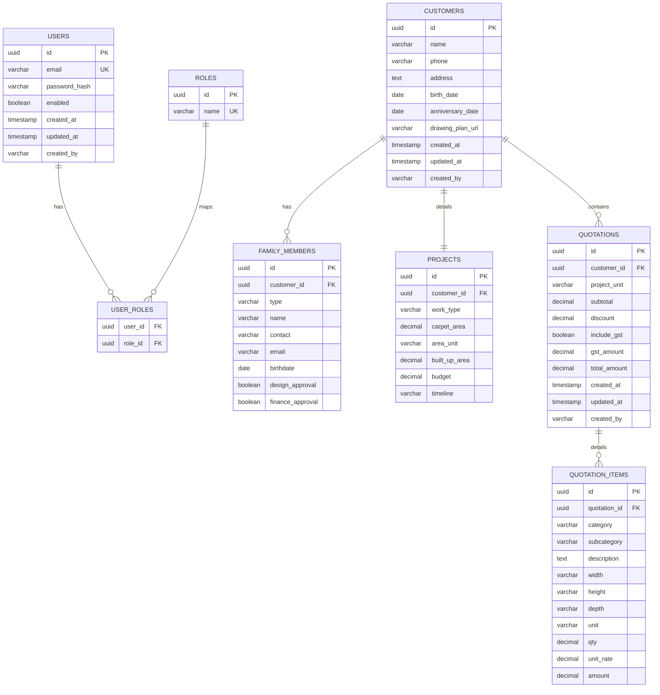

# Implementation Plan - NeoSowInfra Web Application

This document outlines the proposed design and step-by-step implementation plan for converting the HTML prototype into a secure, production-ready web application with a Spring Boot backend and PostgreSQL database.

## User Review Required

> [!IMPORTANT]
> **Demo Project Status:**
> We analyzed the workspace and found only the `demo 2` folder containing the HTML prototype files. The demo Spring Boot project is not present in `/Users/pratikghodke/Desktop/NeoSowInfra`. 
>
> If you have a Spring Boot project you'd like us to evaluate first, please copy it into the `NeoSowInfra` directory. Otherwise, we will proceed by building the project from scratch using the absolute best-practice Clean Architecture and Spring Boot standards.

---

## 1. Recommended Frontend Approach

We evaluated the two options based on the complexity and dynamic nature of the HTML prototype (especially `create.html`):

### Option A: Thymeleaf (Server-Side Rendering)
* **Best for:** Simpler applications with mostly static views and forms.
* **Drawbacks for this app:** The quotation builder (`create.html`) has highly dynamic state: adding/removing items, complex dynamic checkboxes for subcategories, conditional dimension fields (width/height/depth), real-time unit conversions, and calculations that instantly update the subtotal, GST, and total. In Thymeleaf, you would either have to do page-reloads for every change (poor UX) or write a huge volume of custom vanilla JavaScript/jQuery to manipulate the DOM manually, which is prone to bugs and hard to maintain.

### Option B: React (Client-Side SPA) - **(Recommended)**
* **Best for:** Dynamic, stateful, and interactive UIs.
* **Why it fits:** 
  1. **Component Reuse:** The items table, customer details card, and navbar can be cleanly structured into React components.
  2. **Clean State Management:** Real-time calculation rules (Ft-Inch rounding, quantity calculations based on units, discount/GST calculations) can be managed reactively in a local state.
  3. **Separation of Concerns:** React communicates with Spring Boot via JSON REST APIs. This decouples the client and server code, making testing, scalability, and code maintenance much easier.
  4. **User Experience:** Instant calculations, interactive validation, and smooth page transitions with client-side routing.

---

## 2. Database Schema Design (PostgreSQL)

We will use Liquibase to version control and run the schema migrations. IDs will be UUID-based to ensure security and prevent ID enumeration attacks. Audit fields (`created_at`, `updated_at`, `created_by`) will be automatically populated.



### Liquibase Changelog Strategy
* Create `db/changelog/db.changelog-master.xml` as the main registry.
* Group migrations logically (e.g., `001_create_auth_tables.xml`, `002_create_customer_and_project_tables.xml`, `003_create_quotation_tables.xml`).

---

## 3. Standardized API List

All API endpoints will be versioned under `/api/v1` and return standardized responses with appropriate HTTP status codes.

| Method | Endpoint | Description | Auth Roles |
|:---|:---|:---|:---|
| **POST** | `/api/v1/auth/signup` | Register a new user | Public |
| **POST** | `/api/v1/auth/login` | Login and obtain JWT + Refresh Token | Public |
| **POST** | `/api/v1/auth/refresh` | Refresh JWT using refresh token | Public |
| **GET** | `/api/v1/admin/users` | List all users (Paginated & Filtered) | `ADMIN`, `SUPER_ADMIN` |
| **GET** | `/api/v1/admin/users/{id}` | Get specific user details | `ADMIN`, `SUPER_ADMIN` |
| **POST** | `/api/v1/admin/users` | Create user / Assign roles | `SUPER_ADMIN` (for admin creation), `ADMIN` |
| **PUT** | `/api/v1/admin/users/{id}` | Update user role or status | `SUPER_ADMIN`, `ADMIN` |
| **DELETE** | `/api/v1/admin/users/{id}` | Delete user | `SUPER_ADMIN` |
| **GET** | `/api/v1/customers` | List customers (Paginated, filter by name/phone) | `USER`, `ADMIN`, `SUPER_ADMIN` |
| **GET** | `/api/v1/customers/{id}` | Get customer, project, and family details | `USER`, `ADMIN`, `SUPER_ADMIN` |
| **POST** | `/api/v1/customers` | Create new customer, project, and family | `USER`, `ADMIN`, `SUPER_ADMIN` |
| **PUT** | `/api/v1/customers/{id}` | Update customer details | `USER`, `ADMIN`, `SUPER_ADMIN` |
| **DELETE** | `/api/v1/customers/{id}` | Delete customer (Cascade deletes project/family) | `ADMIN`, `SUPER_ADMIN` |
| **POST** | `/api/v1/quotations` | Create a new quotation with items | `USER`, `ADMIN`, `SUPER_ADMIN` |
| **GET** | `/api/v1/quotations/{id}` | Get quotation details & items | `USER`, `ADMIN`, `SUPER_ADMIN` |
| **GET** | `/api/v1/quotations/{id}/pdf` | Generate PDF from quotation using Flying Saucer | `USER`, `ADMIN`, `SUPER_ADMIN` |

---

## 4. Proposed Folder Structure

Following Clean Architecture (JHipster conventions adapted for Maven & clean code):

```text
src/
├── main/
│   ├── java/
│   │   └── com/
│   │       └── neosow/
│   │           └── infra/
│   │               ├── NeoSowInfraApplication.java   # Spring Boot Main Class
│   │               ├── config/                         # SecurityConfig, LiquibaseConfig, CorsConfig
│   │               ├── security/                       # JWTTokenProvider, JwtFilter, UserDetailsService
│   │               ├── exception/                      # GlobalExceptionHandler, CustomExceptions
│   │               ├── model/                          # JPA Entities (User, Role, Customer, Project, etc.)
│   │               ├── repository/                     # Spring Data JPA Repositories
│   │               ├── dto/                            # Request/Response Data Transfer Objects
│   │               │   ├── auth/
│   │               │   ├── customer/
│   │               │   └── quotation/
│   │               ├── mapper/                         # MapStruct Mapper interfaces
│   │               ├── service/                        # Service Interfaces
│   │               │   └── impl/                       # Service Implementations
│   │               └── controller/                     # REST Controllers (Auth, Customer, Admin, Quotation)
│   └── resources/
│       ├── application.yml                             # Centralized settings (DB credentials, JWT secrets)
│       ├── db/
│       │   └── changelog/                              # Liquibase migration files
│       │       ├── db.changelog-master.xml
│       │       └── changelog-001-init.xml
│       └── templates/
│           └── pdf/
│               └── quotation-template.html             # Flying Saucer HTML/Thymeleaf template for PDF
```

---

## 5. Verification & Testing Plan

### Automated Tests
* **Integration Tests**: Spring Boot Security configuration tests, JWT issuing and token refresh logic.
* **Unit Tests**: Business logic unit tests for custom dimension rules (Ft-Inch parsing, rounding, and quantity calculation formulas).
* **MockMvc Tests**: Controllers verification (e.g., verifying role checks on `/api/v1/admin/*` endpoints).

### Manual Verification
* **Postman Collections**: Pre-configured JSON request collections for authentication flow, RBAC verification, customer creation, quotation building, and PDF download.
* **Role Simulation**: Verifying that a `USER` cannot access admin/super admin endpoints and receives `403 Forbidden`.
* **PDF Inspection**: Generating the PDF via Flying Saucer and inspecting formatting, alignments, and GST calculations.

---

## 6. Project Setup Phased Plan

* **Phase 1 (Preparation):** Initialize Spring Boot skeleton (Maven + Java 17/21 + PostgreSQL) and set up the centralized `application.yml`. Configure Liquibase and run DB migrations.
* **Phase 2 (Security):** Implement Spring Security with JWT token issuance, token refreshes, BCrypt hashing, and configure roles (`USER`, `ADMIN`, `SUPER_ADMIN`) with `@PreAuthorize`.
* **Phase 3 (Core API):** Create Entities, Repositories, DTOs, and REST API controllers for Customers, Projects, and Quotations.
* **Phase 4 (Quotation & PDF Engine):** Code the quotation dimension calculation rules and build the PDF generation pipeline using Flying Saucer.
* **Phase 5 (Frontend Integration):** Set up the frontend structure, connect forms and table calculations to backend APIs, and configure secure authentication token handling.
